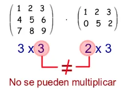

<h1>RNN: Recurrent Neural Network</h1>
<h2>LSTM Included at the end</h2>

I have to say that making a project, at the scale of a simple programmer, on a simple computer, that represents the potential of an RNN, is not easy at all. Perhaps due to the nature of the RNN algorithm itself, it’s impossible.

This video https://youtu.be/hB4XYst_t-I?si=gSIDXG16x9ccce0Q was quite clear to me. I recommend watching it.

What this network does—referring to this toy project—is very simple to explain what an RNN can do.  
Here we can give a text input such as:

    "Hola mundo, aprendien..."

and the network should give us:

    "..do redes recurrentes!"

Being the phrase used to train it: "Hola mundo, aprendiendo redes recurrentes!".  
Do we need an RNN to achieve this? Obviously not. That’s why this introduction exists.  
It’s not what it does, but *how* it does it.

Now, each of the output characters "do redes recurrentes!" is one output. Meaning that for one input, we don’t only have one output, but many associated with a moment in time.

Let’s abbreviate our dataset for a moment to simplify the example.  
"Hola Mundo". A network trained with this dataset will be prepared to know how the sequence continues if we give it an input X_t (X sub t) corresponding to it. For example, the character "a".

So the input "a" will be considered X_0, and the expected output (Y_t: Y sub t) Y_0 should be a space " ".  
Now the network must remember where it comes from to know where it is going. Since, if at some moment the input were an "o", as we see, the dataset has two "o", so it must look at where it comes from. That’s why we say an RNN *remembers*.

RNNs analyze sequences. Each input X and each output Y is associated with a moment in time of that sequence.

X_0: "H", X_1: "o", X_2: "l", X_3: "a", X_4: " ", X_5: "M", X_6: "u", X_7: "n", X_8: "d", X_9: "o"

Y_0: "o", Y_1: "l", Y_2: "a", Y_3: " ", Y_4: "M", Y_5: "u", Y_6: "n", Y_7: "d", Y_8: "o"

The association between inputs and outputs is stored in a state cell A_t (A sub t), which in the code we will see as the previous state hs[t] (hidden state) at each moment.

Every time the RNN is activated to infer an output, it will actually have two inputs and two outputs:

A_(t-1) and X_t will be its inputs, and its outputs will be Y_t and A_t.

Here we have a dataset of 42 characters, 5 words. But applying this same mechanism to huge amounts of data, we can obtain, for example, a text predictor.  
In fact, this is how the first predictive text systems worked.

The idea of this project is that from an input like "mundo", the network REMEMBERS what follows. And “remember” is the key word in the nature of this type of network.  
Given a data point, it will consult the previous data to infer, through statistics, what the expected next data point is.

In the data definition and processing stage we have a simple text string:

    "Hola mundo, aprendiendo redes recurrentes!"

We convert that string into an array of its characters without repetition and sorted.  
We use each character as a key to create a dictionary of numbers, and then we invert the values so that the numbers become the keys.

    chars = sorted(list(set(text)))
    char2idx = {ch: i for i, ch in enumerate(chars)}
    idx2char = {i: ch for i, ch in enumerate(chars)}

And in data, only the numbers corresponding to each character.

    data = [char2idx[c] for c in text]

Then we define the size of the layers, initialize weights with random values, and define bias:

    vocab_size = len(chars) #42
    seq_lenght = 10
    hidden_size = 64
    learning_rate = 1e-2

    Wxh = np.random.randn(hidden_size, vocab_size) * 0.01 #64*42
    Whh = np.random.randn(hidden_size, hidden_size) * 0.01 #64*64
    Why = np.random.randn(vocab_size, hidden_size) * 0.01 #42*64

    bh = np.zeros((hidden_size, 1))
    by = np.zeros((vocab_size, 1))

Does it look like a multilayer MLP network? Well, essentially it is.  
The difference is that we cross weight calculations with a previous state matrix, which at the beginning is a matrix full of zeros. But at each step, the previous state will be the previously evaluated weights.

Let’s start from the beginning… train(data) on line 111 (of the code, not the bus).

As I mentioned earlier, data contains the numbers corresponding to each character of the unique-character collection of our dataset.

    [3, 12, 9, 4, 0, 10, 17, 11, 6, 12, 2, 0, 4, 13, 14, 7, 11, 6, 8, 7, 11, 6, 12, 0, 14, 7, 6, 7, 15, 0, 14, 7, 5, 17, 14, 14, 7, 11, 16, 7, 15, 1]

And as we see, def train(data, n_epochs=1000, seq_length=10) will request data as parameter.  
h_prev is the previous state, which will start as a zero-filled matrix.

    h_prev = np.zeros((hidden_size, 1))
    pointer = 0

h_prev will be of size 64*1. A pointer variable is also initialized, acting as a counter to ensure we don’t take samples beyond the size of data. Since samples will be taken 10 at a time.  
In the for loop that counts our training epochs, we check that pointer resets to zero if (pointer + seq_length + 1) is greater than the size of data, and the previous state (h_prev) is reset to zeros.

Then we take the first 10 values of data and from 1 to 11 into two datasets:

    inputs = data[pointer:pointer+seq_length]
    targets = data[pointer+1:pointer+seq_length+1]

Therefore:

    inputs =  [3, 12, 9, 4, 0, 10, 17, 11, 6, 12, 2]
    targets = [12, 9, 4, 0, 10, 17, 11, 6, 12, 2, 0]

We take inputs and h_prev and pass them to the forward function, which returns 3 values:

    xs, hs, ys = forward(inputs, h_prev)

<h2>Forward</h2>

We declare three empty dictionaries: xs, hs, ys. And we store h_prev in a previous state of hs.

    xs, hs, ys = {}, {}, {}
    hs[-1] = np.copy(h_prev)

Declaring the index of hs as [-1] is a convenience Python gives us. It basically places the assigned value at the end of a row.  
We have a loop for t in range(len(inputs)) that will count to 10. Remember that inputs are samples taken from data, 10 at a time.  
Inside we declare an array "x" of zeros of size 42*1 (the size of the unique character collection of our dataset).

    for t in range(len(inputs)): # 0 to 10
        x = np.zeros((vocab_size, 1)) #42*1
        x[inputs[t]] = 1

And x[inputs[t]] performs a one-hot encoding of the inputs sample received.  
If inputs were, for example: [3, 12, 9, 4, 0, 10, 17, 11, 6, 12, 2], at t=0 inputs[t] will be 3, therefore x = inputs[t] = [0, 0, 0, 1, ... 0, 0, 0] (42 values). This array will be stored in a matrix called xs forming the one-hot array:

    xs[t] = x

The next step is to store the new state hs[t], calculated with the Hyperbolic Tangent function to flatten values between -1 and 0, as observed in the function’s curve:

We sum the multiplication of Wxh with x, Whh with hs[-1], and add the bias bh:

    (np.dot(Wxh, x) + np.dot(Whh, hs[t-1]) + bh)

We know from matrix multiplication rules that the output of this sum will be another 64x1 matrix.

 
 
Wxh * x => 64x42 * 42x1 = 64x1 
Whh * hs[t-1] => 64x64 * 64x1 = 64x1 
bh => 64x1 
matrix(64x1) + matrix(64x1) + matrix(64x1) = matrix(64x1) 
 
To that result we apply the tanh (hyperbolic tangent) function.

Forward then returns xs, hs, and ys.

We saw this already in the MLP network, but here something new is added.  
One of the weight matrices (Wxh) is multiplied with the corresponding one-hot vector. That is the same as in the MLP.  
But here we take another matrix of weights (Whh), multiply it by the previous state h[t-1] (this is the part we could call “remembering”).  
Then we add the bias, just like in the MLP. (np.dot(Wxh, x) + np.dot(Whh, hs[t-1]) + bh).  
The result obtained is the new state hs[t].

Then we multiply the third matrix of weights Why with this new state (hs[t]) and add the last bias by.

    ys[t] = np.dot(Why, hs[t]) + by

Forward then returns xs, hs, and ys.

<h2>Compute Loss</h2>

After processing Forward we pass ys and targets:

    xs, hs, ys = forward(inputs, h_prev)
    loss = compute_loss(ys, targets)

Remember that targets, like inputs, are a selection of 10 values taken from data (seq_length=10), but targets shift the index by one:

    inputs = data[pointer:pointer+seq_length]
    targets = data[pointer+1:pointer+seq_length+1]

And remember that ys is the output layer. The first weight layer was multiplied by the corresponding one-hot and added to the second layer multiplied by the previous state plus its bias.  
That result is multiplied by the current state and added to another bias, resulting in ys.

    def compute_loss(ys, targets):
        loss = 0
        for t in range(len(targets)):
            ps = softmax(ys[t])
            loss += -np.log(ps[targets[t], 0])
        return loss / len(targets)

As many times as there are values in targets we will apply softmax to ys:

    def softmax(v):
        expv = np.exp(v - np.max(v))
        return expv / np.sum(expv)
    

As seen in the curve graph, softmax takes values and flattens them between 0 and 1, giving better placement to both negative and positive values.

    ps = softmax(ys[t])

ys is a dictionary of 10 elements, each element being an array of 42 values.  
Each value is subtracted by the maximum of that array and placed as exponent of e using np.exp.

    expv = np.exp(v - np.max(v))

If for example v were [1.3499, 8.1662, 4.4817, 2.0137], we see that 8.1662 is the maximum. We subtract 8.1662 from each value and obtain:

    [1.3499-8.1662, 8.1662-8.1662, 4.4817-8.1662, 2.0137-8.1662] =
    [−6.8163, 0.0, −3.6845, −6.1525]
    np.exp([−6.8163,0.0,−3.6845,−6.1525])
    [e^−6.8163, e^0.0, e^−3.6845, e^−6.1525]

Then we return each value of that array divided by the sum of the elements of that same array:

    return expv / np.sum(expv)

So ps is a vector containing the softmax-transformed ys values.  
We apply np.log to ps at index targets[t], and that value becomes negative.

    ps = softmax(ys[t])
    loss += -np.log(ps[targets[t], 0])

Those values accumulate in loss, and are returned divided by len(targets), which is 10.

    return loss / len(targets)

Loss is not part of the functional structure of the network, but it allows us to measure how the network is learning.  
These values are printed every 100 training cycles later:

    if epoch % 100 == 0:
        print(f"Epoch {epoch}, loss: {loss:.4f}")

<h2>Backward and weight update</h2>

In our training function, after computing loss per epoch, we perform backpropagation:

    dWxh, dWhh, dWhy, dbh, dby = backward(xs, hs, ys, targets)

As we see, it is called with five variables (dWxh, dWhh, dWhy, dbh, dby), and passed four parameters (xs, hs, ys, targets).

Inside the function we initialize dWxh, dWhh, dWhy, which are matrices the size of the weights Wxh, Whh and Why, but initialized with zeros. Same for dbh and dby, which match the size of bh and by, and for dh_next, which matches the size of hs[0], initialized with zeros.

    dWxh, dWhh, dWhy = np.zeros_like(Wxh), np.zeros_like(Whh), np.zeros_like(Why)
    dbh, dby = np.zeros_like(bh), np.zeros_like(by)
    dh_next = np.zeros_like(hs[0])

A loop begins, counting backwards from 10 to 0, and softmax is applied to ys[t].  
Then, at position targets[t] of ys, we subtract 1, shifting the softmax curve to values between -1 and 0.

    dy = softmax(ys[t])
    dy[targets[t]] -= 1

Although it seems like magic, that is the gradient for dy.  
Recall, ys[t] is a vector of logits of size (vocab_size, 1). Logits meaning they are not yet probabilities, but what the network “thinks” each class score should be.  
After softmax, ys[t] becomes probabilities (their sum equals 1).

targets[t] is the array containing the index of the correct character. In our code we do not recreate the one-hot; instead we simply subtract 1 at that index:

    dy[targets[t]] -= 1

Example with a reduced logits vector:

    dy = [0.62, 0.23, 0.05, 0.10]
    targets[t] = 2
    dy[targets[t]] -= 1
    dy = [0.62, 0.23, -0.95, 0.10]

With the negative gradient, it will adjust the target[t] input to increase its probability.  
With the inputs that are not target[t], it will adjust to decrease probability, since those gradients are positive.

Then we have:

    dWhy += np.dot(dy, hs[t].T)

dy, the gradient with respect to ys[t], is size vocab_size^1 (42x1). hs[t], the hidden layer output, is size hidden_size^1 (64x1). Therefore hs[t].T is size 1^hidden_size (1x64).  
Multiplying them (42x1)^(1x64) yields a 42^64 matrix, the same size as weights Why.

Why do we multiply them? dy tells us how strong the change must be in the specific output, and hs[t].T propagates the change to each connection from the hidden layer.  
dWhy will be used to update Why.

Bias updates simply add the gradient:

    dby += dy

We continue propagating the gradient into the hidden layer through Why:

    dh = np.dot(Why.T, dy) + dh_next
    dh_raw = (1- hs[t] ** 2)*dh

Here dh_raw seems like another derivative. And it is.  
We are multiplying Why.T with dy np.dot(Why.T, dy). As mentioned earlier, dy is the gradient (partial derivative of ys). We propagate it through Why.T and add dh_next, which for now we can say is a gradient coming from the future (we analyze it later).

Now if we look closely, dh_raw equals what looks like the derivative of hyperbolic tangent.  
And it is:

Recall where hs[t] comes from:

    hs[t] = np.tanh(np.dot(Wxh, x) + np.dot(Whh, hs[t-1]) + bh)

Meaning hs[t]^2 is tanh^2(u).

At this point I must say I was extremely confused, and that’s why I say I broke my head trying to understand what was going on until here.  
I was expecting to see the derivative of hyperbolic tangent through chain rule, assuming dh was the derivative of:

    (np.dot(Wxh, x) + np.dot(Whh, hs[t-1]) + bh)

…which was 'u' in hs[t] = tanh(u).  
But no. We work with pure tanh.

I spent two days trying to calculate how one derivative flowed into another and ended up with a mushed brain.

What actually happens is that we multiply the derivative with respect to the hidden layer output h with the gradient of the output, i.e., the gradient of total loss.  
dh_raw is the gradient backpropagated into the h layers, but without yet computing weight adjustments.

We adjust hidden bias:

    dbh += dh_raw

We compute the adjustments:

    dWxh += np.dot(dh_raw, xs[t].T)
    dWhh += np.dot(dh_raw, hs[t].T)

We propagate the gradient to the previous step in time:

    dh_next = np.dot(Whh.T, dh_raw)

<h3>Gradient Clipping</h3>

    for dparam in [dWxh, dWhh, dWhy, dbh, dby]:
        np.clip(dparam, -5, 5, out=dparam)

Clipping in backpropagation is a stabilization technique.  
If a gradient is propagated through many time steps, it can become very large or very small.  
np.clip limits gradient values between -5 and 5, preventing training from breaking with huge values that turn loss into NaN.

Finally we return the adjustments:

    return dWxh, dWhh, dWhy, dbh, dby

Weights are updated:

    global Wxh, Whh, Why, bh, by
    Wxh -= learning_rate * dWxh
    Whh -= learning_rate * dWhh
    Why -= learning_rate * dWhy
    bh -= learning_rate * dbh
    by -= learning_rate * dby

We update the previous layer and pointer for the next epoch:

    h_prev = hs[len(inputs)-1]
    pointer += seq_length

<h2>LSTM</h2>

I recommend watching this video https://www.youtube.com/watch?v=1BubAvTVBYs

LSTM solves a problem of RNNs. When memory is extended long-term, the coefficients that update weights can either blow up to huge values or flatten to tiny ones, causing the network to learn nothing.

LSTM solves this by filtering what the network should remember or forget. And the valuable thing to learn here is the concept of using weights and their linear transformations, segmented, as gates.

If we understand this, it will allow us to advance and learn other types of networks.

As explained at the start of this README, conceptually an RNN is a neural network that learns sequences and remembers them.  
Meaning it does not have a single output, but a sequence of outputs associated with a moment in time.

In our example, "Hola mundo" could be a dataset, and when giving "a" as token input, the network should infer that a space follows, " ", then "m", "u", "n"... etc.

As I mentioned earlier, an RNN has 2 inputs and 2 outputs. It receives the previous state A_(t-1), the token X_t, and outputs Y_t and the new previous state A_t.

LSTM adds gates to filter what to remember, what to forget, and what to filter into the hidden state.

But if we study the code, we see these gates are nothing more than the way we structure weights and how we work with the processed data using mathematical operations.

These gates are simply linear transformations of the input or between the gates themselves.

    #Forget gate
    Wf, Uf, bf = rand_params()
    #Input gate
    Wi, Ui, bi = rand_params()
    #Cell candidate
    Wo, Uo, bo = rand_params()
    #Output gate
    Wc, Uc, bc = rand_params()

LSTM adds a new cell called State Cell, cs[t].  
Even though conceptually we talk about memory, we work with values stored in matrices. Each row of this matrix is the state of a time step.

The values stored in cs interact with the gates and finally fall into the output. This allows the state cell to retain or forget data and apply these decisions to the output.

For example, we can perform a linear transformation of the input over a matrix of weights that will be filtered with a sigmoid and multiplied by a new cell C_t (Cellstate sub t), in code cs[t].

So LSTM has 3 inputs: X_t, A_(t-1), and C_(t-1). And 3 outputs: Y_t, A_t, and C_t.

The weight matrices therefore no longer only perform linear or cross transformations, but they also interact...
