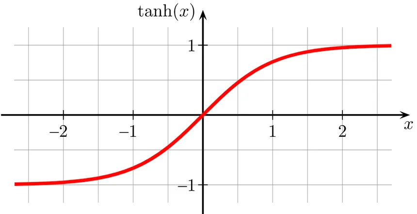
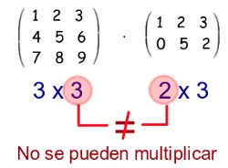
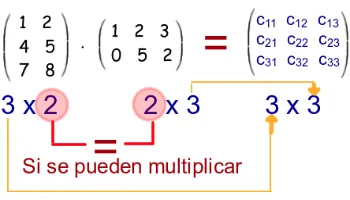
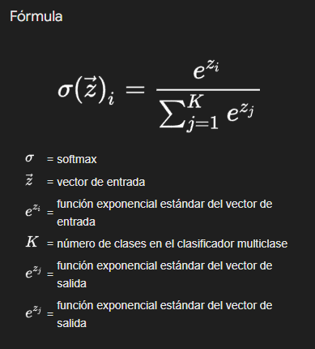
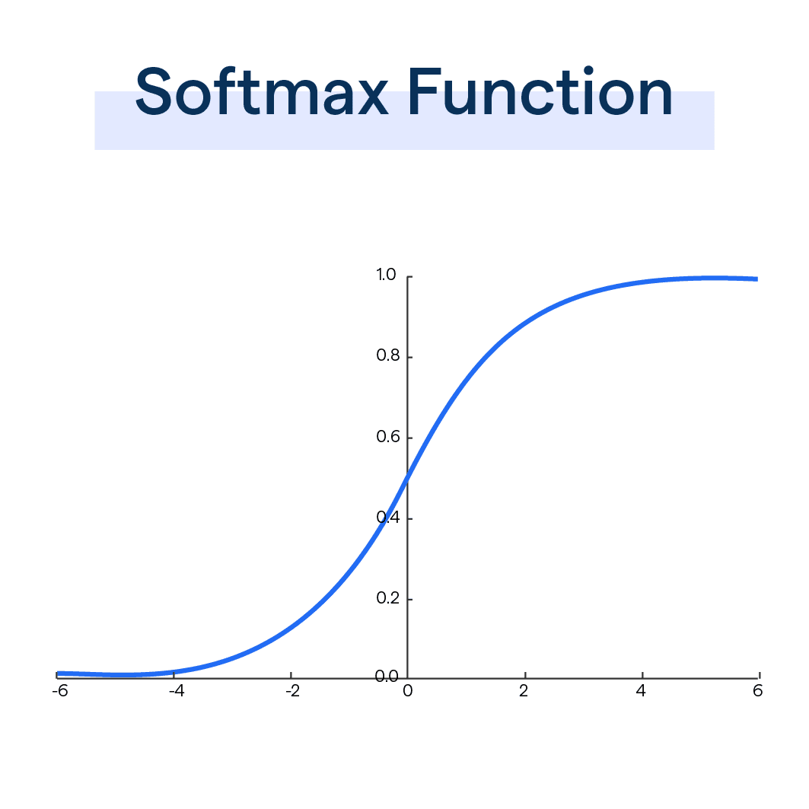
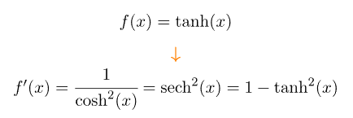

<h1>RNN: Recurrent Neural Network</h1>

Tengo que decir que hacer un proyecto a la escala de un simple programador, en una simple computadora, que represente el potencial de una RNN, no es nada facil. Quizas por la naturaleza de el algoritmo RNN por si mismo, es imposible.

Lo que hace esta red, me refiero a este proyecto toy, es muy simple para explicar lo que una RNN puede hacer.
Aqui podemos dar una entrada de texto, como:

    "Hola mundo, aprendien..."
    
y la red debera darnos:

    "..do redes recurrentes!"

Siendo la frase con la que se entrenó "Hola mundo, aprendiendo redes recurrentes!"
¿Hace falta una RNN para conseguir esto?. Obvio que no. Por eso esta introducción.
Aqui tenemos un dataset de 42 caracteres, 5 palabras. Pero aplicando esto mismo a cantidades ingentes de datos, podemos obtener por ejemplo, un predictivo de texto.
De hecho asi funcionaron los primeros predictivos.

La idea de este proyecto es que a partir de una entrada como "mundo" la red RECUERDE que es lo que sigue. Y es que recordar, es la palabra clave en la naturaleza de este tipo de red.
Dado un dato, consultara los datos previos para inferir mediante estadisticas, que dato es el esperado a seguir.

En la etapa de definicion y procesamiento de datos tenemos una cadena de texto simple:

    "Hola mundo, aprendiendo redes recurrentes!"

A esa cadena la convertimos a un array de sus caracteres sin repetir y ordenados. Usamos cada caracter como llave para crear un diccionario de numeros y luego invertimos los valores para que la llave sean los numeros.

    chars = sorted(list(set(text)))
    char2idx = {ch: i for i, ch in enumerate(chars)}
    idx2char = {i: ch for i, ch in enumerate(chars)}

Y en data, solo los numeros correspondientes a cada caracter.

    data = [char2idx[c] for c in text]

Luego tenemos definiciones de el tamaño de las capas, iniciacion de pesos con valores randooms y bias:

    vocab_size = len(chars) #42
    seq_lenght = 10
    hidden_size = 64
    learning_rate = 1e-2

    Wxh = np.random.randn(hidden_size, vocab_size) * 0.01 #64*42
    Whh = np.random.randn(hidden_size, hidden_size) * 0.01 #64*64
    Why = np.random.randn(vocab_size, hidden_size) * 0.01 #42*64

    bh = np.zeros((hidden_size, 1))
    by = np.zeros((vocab_size, 1))

Se ve como una red multicapa MLP? bueno, en escencia lo es. La diferencia es que cruzamos los calculos de los pesos con una matriz de estado previo, la cual en el inicio será una matriz de ceros. Pero a cada paso, el estado previo serán los pesos evaluados previamente.

Empecemos por el inicio... train(data) en la linea 111 (del codigo, no el bondi).

Como dije antes, data contiene los numeros correspondiente a cada caracter de la coleccion de caracteres unicos de nuestro dataset.

    [3, 12, 9, 4, 0, 10, 17, 11, 6, 12, 2, 0, 4, 13, 14, 7, 11, 6, 8, 7, 11, 6, 12, 0, 14, 7, 6, 7, 15, 0, 14, 7, 5, 17, 14, 14, 7, 11, 16, 7, 15, 1]

Y como vemos def train(data, n_epochs=1000, seq_length=10) solicitara data de parametro.
h_prev es el estado previo, que comenzara como una matriz repleta de ceros.

    h_prev = np.zeros((hidden_size, 1))
    pointer = 0

h_prev tendra un tamaño 64*1. Tambien se inicializa una variable pointer, que hará la funcion de contador, para asegurarnos de no tomar muestras, mas allá del tamaño del data. Pues se tomara de 10 en 10.
En el ciclo for que cuenta nuestros entrenamientos controlaremos que la variable pointer se resetee a cero si (pointer + seq_length + 1) es mayor al tamaño de la data y vuelve a colocar el estado previo (h_prev) en ceros.

Luego tomo los primeros 10 valores de data y del 1 al 11 en dos set de datos:

    inputs = data[pointer:pointer+seq_length]
    targets = data[pointer+1:pointer+seq_length+1]

por lo tanto:

    inputs =  [3, 12, 9, 4, 0, 10, 17, 11, 6, 12, 2]
    targets = [12, 9, 4, 0, 10, 17, 11, 6, 12, 2, 0]

Tomamos a inputs y a h_prev y lo metemos a la funcion forward, la que nos retornara 3 valores:

    xs, hs, ys = forward(inputs, h_prev)

<h2>Forward</h2>

Declaramos tres diccionarios vacios, xs, hs, ys. Y guardamos h_prev en un estado previo de hs.

    xs, hs, ys = {}, {}, {}
    hs[-1] = np.copy(h_prev)

Declara el indise de hs en [-1] es una facilidad que Python nos da. Y basicamente coloca al final de una fila un valor asignado.
Tenemos un bucle for t in range(len(inputs)) que contará hasta 10. Recordemos que inputs son muestras de data, tomadas de 10 en 10.
Dentro declaramos un array "x" de ceros de 42*1 (el tamaño de la coleccion de caracteres sin repetir del dataset).

    for t in range(len(inputs)): # 0 a 10
        x = np.zeros((vocab_size, 1)) #42*1
        x[inputs[t]] = 1

Y x[inputs[t]] hará un hot-encoding de la muestra de inputs recibida.
Si inputs era por ejemplo: [3, 12, 9, 4, 0, 10, 17, 11, 6, 12, 2], en t=0 inputs[t] será 3 y por lo tanto x=inputs[t]=[0, 0, 0, 1, ... 0, 0, 0] (42 valores). y Ese array ira a guardarse a una matriz llamada xs formando el array de one-hot

    xs[t] = x

El siguiente paso es guardar el nuevo estado en hs[t], calculandolo con la función Tangente Hiperbolica, para aplanar los valores entre -1 y 0. Como se observa en la curva que dibuja la función:

Se sumaran la multiplicacion de Wxh con x, de Whh con hs[-1] y se le sumaran el bias bh.

    (np.dot(Wxh, x) + np.dot(Whh, hs[t-1]) + bh)

Sabemos por las reglas de multiplicacion de matrices que la salida de estas suma sera otra matriz de 64x1

 
 
Wxh * x => 64x42 * 42x1 = 64x1 
Whh * hs[t-1] => 64x64 * 64x1 = 64x1 
bh => 64x1 
matriz(64x1) + matriz(64x1) + matriz(64x1) = matriz(64x1) 
 
A ese resultado es al que se le aplicará la funcion tanh (tangente hiperbolica)

Forward entonces retorna xs hs y ys.

Esto, lo vimos ya en la red MLP, pero aqui se agrega un elemento.
Una de las matrices de pesos (Wxh) se multiplica con el one-hot correspondiente al ciclo. Eso es igual en la red MLP.
Pero aqui tomamos otra matriz de pesos (Whh) se multiplica con el estado anteior h[t-1] (Esta es la parte en que podriamos decir que "recuerda").
Luego se suma al bias, como tambien era en la red MLP. (np.dot(Wxh, x) + np.dot(Whh, hs[t-1]) + bh).
El resultado obtenido es el estado nuevo hs[t].

Luego se multiplica la tercer matriz de pesos Why con este estado nuevo (hs[t]) y se suma el ultimo peso by.

    ys[t] = np.dot(Why, hs[t]) + by

Forward entonces retorna xs hs y ys.

<h2>Compute Loss</h2>

Luego de procesar el Forward pasamos ys y targets:

    xs, hs, ys = forward(inputs, h_prev)
    loss = compute_loss(ys, targets)

Recordemos que targets, es al igual que inputs, una seleccion de 10 valores tomados de data (seq_length=10), sin embargo targets desplaza en uno el indice de los datos tomados

    inputs = data[pointer:pointer+seq_length]
    targets = data[pointer+1:pointer+seq_length+1]

Y recordemos que ys es el la capa de salida. La primer capa de pesos fue multiplicada por el hot-one correspondiente, y sumada a la segunda capa multiplicada por el estado anterior al actual mas su bias. Al resultado de lo anterior, se lo multiplica por el estado actual y se le suma otro bias, resultando en ys.

    def compute_loss(ys, targets):
        loss = 0
        for t in range(len(targets)):
            ps = softmax(ys[t])
            loss += -np.log(ps[targets[t], 0])
        return loss / len(targets)

Tantas veces como valoers existan en target aplicaremos softmax a ys:

    def softmax(v):
        expv = np.exp(v - np.max(v))
        return expv / np.sum(expv)
    

Como se ve en la grafica de la curva. Softmax toma valores y los aplana entre 0 y 1, dando mejor colocación tanto a valores negativos como positivos.

    ps = softmax(ys[t])

ys es un diccionario de 10 elemento y cada elemento un array de 42 valores. A cada valor se le resta el maximo de ese mismo array y se coloca como exponente del numero e con np.exp

    expv = np.exp(v - np.max(v))

Si por ejempo v fuera [1.3499, 8.1662, 4.4817, 2.0137], observamos que 8.1662 es el valor máximo. Restamos 8.1662 a cada valor y obtenemos:

    [1.3499-8.1662, 8.1662-8.1662, 4.4817-8.1662, 2.0137-8.1662] =
    [−6.8163, 0.0, −3.6845, −6.1525]
    np.exp([−6.8163,0.0,−3.6845,−6.1525])
    [e^−6.8163, e^0.0, e^−3.6845, e^−6.1525]

Luego retornamos cada valor de ese array, dividido por la sumatoria de los elementos de ese mismo array.

    return expv / np.sum(expv)

Entonces ps es un vector con los valores de ys pasados por softmax. a ese array le aplicamos el np.log en el indice targets[t]. Y ese valor lo pasamos a negativo.

    ps = softmax(ys[t])
    loss += -np.log(ps[targets[t], 0])

Esos valores se acumulan en loss. Y se retornan dividiendolos por len(targets) que es 10

    return loss / len(targets)

Loss no es parte de la estructura funcional de la red. Pero nos permite obtener mediciones sobre como va aprendiendo la red.
Estos valores se muestran cada 100 ciclos de entrenamiento mas tarde:

    if epoch % 100 == 0:
        print(f"Epoch {epoch}, loss: {loss:.4f}")

<h2>Backward y actualización de pesos</h2>

En nuesta función de entrenamiento, luego de calcular la perdida pro epoch, sigue la retropropagación:

    dWxh, dWhh, dWhy, dbh, dby = backward(xs, hs, ys, targets)

Como se ve, es llamada con cinco variables (dWxh, dWhh, dWhy, dbh, dby), y se les pasa cuatro parametros (xs, hs, ys, targets).

Dentro de la funcion se inicializan dWxh, dWhh y dWhy, que son matrices del tamaño de los pesos Wxh, Whh y Why, inicializadas completamente con ceros. Lo mismo para dbh y dby que son de tamaño bh y by, y lo mismo para dh_next, que copia el tamaño de hs[0], tambien inicializada con ceros.

    dWxh, dWhh, dWhy = np.zeros_like(Wxh), np.zeros_like(Whh), np.zeros_like(Why)
    dbh, dby = np.zeros_like(bh), np.zeros_like(by)
    dh_next = np.zeros_like(hs[0])

Se inicia un bucle for que contara en reversa desde 10 hasta 0 y se aplica softmax a ys[t]
Luego en la posicion targets[t] de ys se resta 1. Desplazando asi la curvade softmax a numeros entre -1 y 0.

    dy = softmax(ys[t])
    dy[targets[t]] -= 1

Aunque parezca magia. Esa es la gradiente para dy.
Repasando, ys[t] es un vector de logits de tamaño (vocab_size, 1). Con logits nos referimos a un vector de valores que aun no son probabilidades, sino lo que la red piensa que es cada clase correcta.
Al ys[t] por softmax se convierten en probabilidades (la suma de los vectores resulta en 1).

Target[t] es el array que contiene el indice el caracter correcto. En nuestro codigo no creamos nuevamente el one-hot, sino que ya obteniendo el indice por target[t] restamos 1 en ese indice

    dy[targets[t]] -= 1

Ejemplo con un logits reducido:

    dy = [0.62, 0.23, 0.05, 0.10]
    targets[t] = 2
    dy[targets[t]] -= 1
    dy = [0.62, 0.23, -0.95, 0.10]

Con el gradiente negativo, ajustará la entrada target[t] para aumentar su probabilidad.
Con las entradas que no son target[t] se ajustará para disminuir la probabilidad, ya que los gradientes son positivos.
Luego tenemos:

    dWhy += np.dot(dy, hs[t].T)

dy, la gradiente respecto a ys[t] tiene un tamaño vocab_size^1 (42x1). hs[t] es la salida de la capa oculta y tiene un tamaño hidden_size^1 (64x1). Por lo que la transpuesta de hs[t], ht[t].T tiene un tamaño 1^hidden_size (1x64).
Por lo que multiplicandolas (42x1)^(1x64) obtenemos una matriz de 42^64, mismo tamaño que los pesos Why.

Por que los multiplicamos? dy nos dice que tan fuerte debe ser el cambio en la salida especifica y hs[t].T propaga el cambio a cada conexion de la capa oculta.
dWhy se usará para ajustar los pesos de Why.

En tanto a la actualización de los bias. Se les suma la gradiente.

    dby += dy

Proseguimos propagando la gradiente con la capa oculta Why:

    dh = np.dot(Why.T, dy) + dh_next
    dh_raw = (1- hs[t] ** 2)*dh

Aqui en dh_raw tenemos otra derivada. No lo parece? yo igual me rompí la cabeza para verlo. Pero aqui una explicación (o intento de una).
Estamos multiplicando la transpuesta de Why con dy np.dot(Why.T, dy). Como dijismos antes, dy es la gradiente, es decir la derivada parcial de ys. La propagamos por Why.T y le sumamos dh_next que por el momento, solo diremos que es una gradiente que viene desde el futuro (la vemos mas atentamente adelante).
Ahora si miramos bien, d_hraw está igualada a algo que se ve como la derivada de tangente hiperbolica.
Pues no se parece, lo es...

Recordemos de donde viene hs[t]:

    hs[t] = np.tanh(np.dot(Wxh, x) + np.dot(Whh, hs[t-1]) + bh)

Es decir que hs[t]^2 es tanh^2(u).

En este punto tengo que decir que tuve una confusión enorme, y por eso digo que me rompí el coco para entender lo que pasaba hasta este punto. Pues estaba esperando ver la derivada de la tangente hiperbolica por cadena, y asimilaba que dh era la derivada de...

    (np.dot(Wxh, x) + np.dot(Whh, hs[t-1]) + bh)
    
...era 'u' en hs[t] = tanh(u). Pero no. Se trabaja con la tanh pura.
Pase dos días intentando calcular como una derivaba en otra y termine con el cerebro hecho puré.

Lo que sucede realmente es que multiplicamos la derivada respecto a la salida de la capa oculta h con la gradiente de la salida y... Es decir la gradiente de la perdida total.
dh_raw es la gradiente retropropagada a las capas h, pero aun sin calcular los cambios que debe hacer al los pesos.

Se ajustan los bias h:

    dbh += dh_raw

Se calculan los ajustes que se haran a los pesos:

    dWxh += np.dot(dh_raw, xs[t].T)
    dWhh += np.dot(dh_raw, hs[t].T)

Propagamos el gradiente hacia la capa que proviene del paso anterior en el tiempo:

    dh_next = np.dot(Whh.T, dh_raw)

<h3>Clipping de Gradientes</h3>

    for dparam in [dWxh, dWhh, dWhy, dbh, dby]:
        np.clip(dparam, -5, 5, out=dparam)

El Clipping en la retropropagacion, es una tecnica de estabilización. Si un gradiente se propaga a travez de muchos pasos temporales, este puede volverse muy grande, o muy pequeño.
Con np.clip se limitan los valores de los gradientes entre -5 y 5. Esto evita que el entrenamiento se rompa con valores tan grandes que la perdida se vuelve NaN (not a number).

Finalmente retornamos los ajustes:

    return dWxh, dWhh, dWhy, dbh, dby

Se actualizan los pesos:

    global Wxh, Whh, Why, bh, by
    Wxh -= learning_rate * dWxh
    Whh -= learning_rate * dWhh
    Why -= learning_rate * dWhy
    bh -= learning_rate * dbh
    by -= learning_rate * dby

Actualizo la capa previa y el pointer para el siguiente epoch:

    h_prev = hs[len(inputs)-1]
    pointer += seq_length

