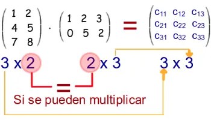
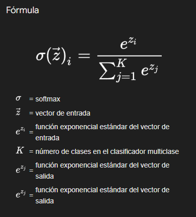
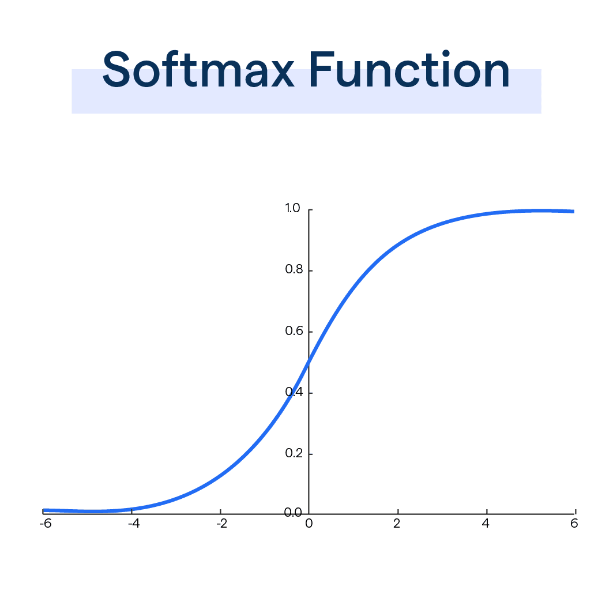

<h1>RNN: Rede Neural Recorrente</h1>
<h2>LSTM Incluído ao final</h2>

Tenho que dizer que fazer um projeto na escala de um simples programador, em um computador simples, que represente o potencial de uma RNN, não é nada fácil. Talvez, pela natureza do algoritmo RNN em si, seja impossível.

Este vídeo https://youtu.be/hB4XYst_t-I?si=gSIDXG16x9ccce0Q me pareceu bastante claro. Recomendo assisti-lo.

O que esta rede faz, refiro-me a este projeto toy, é muito simples para explicar o que uma RNN pode fazer.
Aqui podemos dar uma entrada de texto, como:

    "Hola mundo, aprendien..."
    
e a rede deverá nos dar:

    "..do redes recurrentes!"

Sendo a frase com a qual foi treinada "Hola mundo, aprendiendo redes recurrentes!".
É preciso uma RNN para conseguir isso? Obviamente não. Por isso esta introdução.
Não é o que faz, mas como faz.

Agora bem, cada um dos caracteres de saída "do redes recurrentes!" é uma saída. Ou seja, para uma entrada, não teremos apenas uma saída, mas várias associadas a um momento de tempo.

Abreviemos nosso dataset um momento para simplificar o exemplo.
"Hola Mundo". Uma rede treinada com este dataset estará preparada para saber como a cadeia continua se dermos uma entrada, X_t (X subscrito t) correspondente a ela. Por exemplo, o caractere "a".

Então a entrada "a" será considerada X_0 e a saída (Y_t: Y subscrito t) esperada Y_0 deverá ser um espaço " ".
Agora a rede deve lembrar de onde vem para saber para onde vai. Dado que, se em algum momento a entrada fosse um "o", como vemos, o dataset tendo dois "o", deve olhar de onde vem. É por isso que se diz que uma RNN lembra.

As RNN analisam sequências. Cada entrada X e cada saída Y está associada a um momento do tempo dessa sequência.

X_0: "H", X_1: "o", X_2: "l", X_3: "a", X_4: " ", X_5: "M", X_6: "u", X_7: "n", X_8: "d", X_9: "o"

Y_0: "o", Y_1: "l", Y_2: "a", Y_3: " ", Y_4: "M", Y_5: "u", Y_6: "n", Y_7: "d", Y_8: "o"

A associação entre as entradas e as saídas é armazenada em uma célula de estados A_t (A subscrito t) que no código veremos como o estado prévio hs[t] (hidden state) para cada momento.

Cada vez que a RNN se ativa para inferir uma saída, na realidade terá duas entradas e duas saídas.

A_(t-1) e X_t serão suas entradas e como saídas Y_t e A_t.

Aqui temos um dataset de 42 caracteres, 5 palavras. Mas aplicando isso mesmo a quantidades gigantescas de dados, podemos obter, por exemplo, um preditivo de texto.
De fato, assim funcionaram os primeiros preditivos.

A ideia deste projeto é que, a partir de uma entrada como "mundo", a rede LEMBRE o que vem depois. E é que recordar é a palavra-chave na natureza deste tipo de rede.
Dado um dado, consultará os dados prévios para inferir, mediante estatísticas, qual dado é esperado a seguir.

Na etapa de definição e processamento de dados temos uma cadeia de texto simples:

    "Hola mundo, aprendiendo redes recurrentes!"

Essa cadeia a convertimos em um array de seus caracteres sem repetir e ordenados. Usamos cada caractere como chave para criar um dicionário de números e depois invertimos os valores para que as chaves sejam os números.

    chars = sorted(list(set(text)))
    char2idx = {ch: i for i, ch in enumerate(chars)}
    idx2char = {i: ch for i, ch in enumerate(chars)}

E em data, apenas os números correspondentes a cada caractere.

    data = [char2idx[c] for c in text]

Depois temos definições do tamanho das camadas, iniciação de pesos com valores aleatórios e bias:

    vocab_size = len(chars) #42
    seq_lenght = 10
    hidden_size = 64
    learning_rate = 1e-2

    Wxh = np.random.randn(hidden_size, vocab_size) * 0.01 #64*42
    Whh = np.random.randn(hidden_size, hidden_size) * 0.01 #64*64
    Why = np.random.randn(vocab_size, hidden_size) * 0.01 #42*64

    bh = np.zeros((hidden_size, 1))
    by = np.zeros((vocab_size, 1))

Parece uma rede multicamada MLP? Bem, em essência é. A diferença é que cruzamos os cálculos dos pesos com uma matriz de estado prévio, a qual no início será uma matriz de zeros. Mas a cada passo, o estado prévio serão os pesos avaliados previamente.

Comecemos pelo início... train(data) na linha 111 (do código, não do ônibus).

Como disse antes, data contém os números correspondentes a cada caractere da coleção de caracteres únicos do nosso dataset.

    [3, 12, 9, 4, 0, 10, 17, 11, 6, 12, 2, 0, 4, 13, 14, 7, 11, 6, 8, 7, 11, 6, 12, 0, 14, 7, 6, 7, 15, 0, 14, 7, 5, 17, 14, 14, 7, 11, 16, 7, 15, 1]

E como vemos, def train(data, n_epochs=1000, seq_length=10) solicitará data como parâmetro.
h_prev é o estado prévio, que começará como uma matriz cheia de zeros.

    h_prev = np.zeros((hidden_size, 1))
    pointer = 0

h_prev terá tamanho 64*1. Também se inicializa uma variável pointer, que fará a função de contador, para garantir que não tomemos amostras além do tamanho de data. Pois serão tomadas de 10 em 10.
No ciclo for que conta nossos treinamentos controlaremos que a variável pointer se reinicie a zero se (pointer + seq_length + 1) for maior que o tamanho de data e volte a colocar o estado prévio (h_prev) em zeros.

Depois tomo os primeiros 10 valores de data e de 1 ao 11 em dois conjuntos de dados:

    inputs = data[pointer:pointer+seq_length]
    targets = data[pointer+1:pointer+seq_length+1]

Portanto:

    inputs =  [3, 12, 9, 4, 0, 10, 17, 11, 6, 12, 2]
    targets = [12, 9, 4, 0, 10, 17, 11, 6, 12, 2, 0]

Tomamos inputs e h_prev e colocamos na função forward, que nos retornará 3 valores:

    xs, hs, ys = forward(inputs, h_prev)

<h2>Forward</h2>

Declaramos três dicionários vazios, xs, hs, ys. E guardamos h_prev em um estado prévio de hs.

    xs, hs, ys = {}, {}, {}
    hs[-1] = np.copy(h_prev)

Declarar o índice de hs em [-1] é uma facilidade que Python nos dá. E basicamente coloca no final de uma fila um valor atribuído.
Temos um loop for t in range(len(inputs)) que contará até 10. Lembremos que inputs são amostras de data, tomadas de 10 em 10.
Dentro declaramos um array "x" de zeros de 42*1 (o tamanho da coleção de caracteres sem repetir do dataset).

    for t in range(len(inputs)): # 0 a 10
        x = np.zeros((vocab_size, 1)) #42*1
        x[inputs[t]] = 1

E x[inputs[t]] fará um one-hot encoding da amostra de inputs recebida.
Se inputs era, por exemplo: [3, 12, 9, 4, 0, 10, 17, 11, 6, 12, 2], em t=0 inputs[t] será 3 e, portanto, x = inputs[t] = [0, 0, 0, 1, ... 0, 0, 0] (42 valores). Esse array será guardado em uma matriz chamada xs formando o array one-hot:

    xs[t] = x

O próximo passo é guardar o novo estado em hs[t], calculando-o com a função Tangente Hiperbólica, para achatar os valores entre -1 e 0. Como se observa na curva que desenha a função:

Serão somadas a multiplicação de Wxh com x, de Whh com hs[-1] e será somado o bias bh.

    (np.dot(Wxh, x) + np.dot(Whh, hs[t-1]) + bh)

Sabemos pelas regras de multiplicação de matrizes que a saída dessa soma será outra matriz de 64x1.

 
 
Wxh * x => 64x42 * 42x1 = 64x1 
Whh * hs[t-1] => 64x64 * 64x1 = 64x1 
bh => 64x1 
matriz(64x1) + matriz(64x1) + matriz(64x1) = matriz(64x1) 
 
A esse resultado é aplicada a função tanh (tangente hiperbólica).

Forward então retorna xs, hs e ys.

Isso já vimos na rede MLP, mas aqui se agrega um elemento.
Uma das matrizes de pesos (Wxh) se multiplica com o one-hot correspondente ao ciclo. Isso é igual na rede MLP.
Mas aqui tomamos outra matriz de pesos (Whh), multiplicamos com o estado anterior h[t-1] (esta é a parte em que poderíamos dizer que "lembra").
Depois se soma o bias, como também era na rede MLP. (np.dot(Wxh, x) + np.dot(Whh, hs[t-1]) + bh).
O resultado obtido é o novo estado hs[t].

Depois se multiplica a terceira matriz de pesos Why com esse novo estado (hs[t]) e soma-se o último peso by.

    ys[t] = np.dot(Why, hs[t]) + by

Forward então retorna xs, hs e ys.

<h2>Compute Loss</h2>

Depois de processar o Forward passamos ys e targets:

    xs, hs, ys = forward(inputs, h_prev)
    loss = compute_loss(ys, targets)

Lembremos que targets, assim como inputs, é uma seleção de 10 valores tomados de data (seq_length=10); porém targets desloca em um o índice dos dados tomados.

    inputs = data[pointer:pointer+seq_length]
    targets = data[pointer+1:pointer+seq_length+1]

E lembremos que ys é a camada de saída. A primeira camada de pesos foi multiplicada pelo one-hot correspondente e somada à segunda camada multiplicada pelo estado anterior ao atual mais seu bias. Ao resultado disso é multiplicado pelo estado atual e se soma outro bias, resultando em ys.

    def compute_loss(ys, targets):
        loss = 0
        for t in range(len(targets)):
            ps = softmax(ys[t])
            loss += -np.log(ps[targets[t], 0])
        return loss / len(targets)

Tantas vezes quantos valores existam em target aplicaremos softmax a ys:

    def softmax(v):
        expv = np.exp(v - np.max(v))
        return expv / np.sum(expv)
    

Como se vê no gráfico da curva, softmax toma valores e os achata entre 0 e 1, dando melhor colocação tanto a valores negativos quanto positivos.

    ps = softmax(ys[t])

ys é um dicionário de 10 elementos e cada elemento é um array de 42 valores. A cada valor se subtrai o máximo desse mesmo array e coloca-se como expoente do número e com np.exp.

    expv = np.exp(v - np.max(v))

Se por exemplo v fosse [1.3499, 8.1662, 4.4817, 2.0137], observamos que 8.1662 é o valor máximo. Subtraímos 8.1662 de cada valor e obtemos:

    [1.3499-8.1662, 8.1662-8.1662, 4.4817-8.1662, 2.0137-8.1662] =
    [−6.8163, 0.0, −3.6845, −6.1525]
    np.exp([−6.8163,0.0,−3.6845,−6.1525])
    [e^−6.8163, e^0.0, e^−3.6845, e^−6.1525]

Depois retornamos cada valor desse array dividido pela soma dos elementos desse mesmo array.

    return expv / np.sum(expv)

Então ps é um vetor com os valores de ys passados por softmax. A esse array aplicamos np.log no índice targets[t]. E esse valor o passamos a negativo.

    ps = softmax(ys[t])
    loss += -np.log(ps[targets[t], 0])

Esses valores se acumulam em loss. E retornam-se dividindo-os por len(targets), que é 10.

    return loss / len(targets)

Loss não é parte da estrutura funcional da rede, mas nos permite obter medições sobre como a rede está aprendendo.
Estes valores são mostrados a cada 100 ciclos de treinamento mais tarde:

    if epoch % 100 == 0:
        print(f"Epoch {epoch}, loss: {loss:.4f}")

<h2>Backward e atualização de pesos</h2>

Na nossa função de treinamento, depois de calcular a perda por epoch, segue a retropropagação:

    dWxh, dWhh, dWhy, dbh, dby = backward(xs, hs, ys, targets)

Como se vê, é chamada com cinco variáveis (dWxh, dWhh, dWhy, dbh, dby), e se passam quatro parâmetros (xs, hs, ys, targets).

Dentro da função se inicializam dWxh, dWhh e dWhy, que são matrizes do tamanho dos pesos Wxh, Whh e Why, inicializadas completamente com zeros. O mesmo para dbh e dby que são do tamanho de bh e by, e o mesmo para dh_next, que copia o tamanho de hs[0], também inicializada com zeros.

    dWxh, dWhh, dWhy = np.zeros_like(Wxh), np.zeros_like(Whh), np.zeros_like(Why)
    dbh, dby = np.zeros_like(bh), np.zeros_like(by)
    dh_next = np.zeros_like(hs[0])

Inicia-se um loop for que conta em reverso de 10 até 0 e aplica softmax a ys[t].
Depois, na posição targets[t] de ys se subtrai 1, deslocando assim a curva de softmax para números entre -1 e 0.

    dy = softmax(ys[t])
    dy[targets[t]] -= 1

Embora pareça mágica, essa é a gradiente para dy.
Relembrando, ys[t] é um vetor de logits de tamanho (vocab_size, 1). Com logits nos referimos a um vetor de valores que ainda não são probabilidades, mas o que a rede “pensa” que é cada classe correta.
Ao ys[t] por softmax convertem-se em probabilidades (a soma dos vetores resulta em 1).

targets[t] é o array que contém o índice do caractere correto. No nosso código não criamos novamente o one-hot, mas já obtendo o índice por targets[t] subtraímos 1 nesse índice.

    dy[targets[t]] -= 1

Exemplo com um logits reduzido:

    dy = [0.62, 0.23, 0.05, 0.10]
    targets[t] = 2
    dy[targets[t]] -= 1
    dy = [0.62, 0.23, -0.95, 0.10]

Com a gradiente negativa, ajustará a entrada targets[t] para aumentar sua probabilidade.
Com as entradas que não são targets[t] se ajustará para diminuir a probabilidade, já que as gradientes são positivas.
Depois temos:

    dWhy += np.dot(dy, hs[t].T)

dy, a gradiente respeito a ys[t], tem tamanho vocab_size^1 (42x1). hs[t] é a saída da camada oculta e tem tamanho hidden_size^1 (64x1). Portanto, a transposta de hs[t], hs[t].T, tem tamanho 1^hidden_size (1x64).
Por isso, multiplicando-as (42x1)^(1x64) obtemos uma matriz de 42^64, mesmo tamanho que os pesos Why.

Por que as multiplicamos? dy nos diz quão forte deve ser a mudança na saída específica e hs[t].T propaga a mudança a cada conexão da camada oculta.
dWhy será usado para ajustar os pesos de Why.

Quanto à atualização dos bias, soma-se a gradiente.

    dby += dy

Prosseguimos propagando a gradiente com a camada oculta Why:

    dh = np.dot(Why.T, dy) + dh_next
    dh_raw = (1- hs[t] ** 2)*dh

Aqui em dh_raw temos outra derivada. Não parece? Eu também quebrei a cabeça para ver. Mas aqui uma explicação (ou tentativa).
Estamos multiplicando a transposta de Why com dy np.dot(Why.T, dy). Como dissemos antes, dy é a gradiente, ou seja, a derivada parcial de ys. A propagamos por Why.T e somamos dh_next que, por enquanto, só diremos que é uma gradiente que vem do futuro (veremos mais adiante).
Agora, se olharmos bem, dh_raw está igualado a algo que se parece com a derivada da tangente hiperbólica.
Pois não parece: é...

Lembremos de onde vem hs[t]:

    hs[t] = np.tanh(np.dot(Wxh, x) + np.dot(Whh, hs[t-1]) + bh)

Ou seja, hs[t]^2 é tanh^2(u).

Neste ponto tenho que dizer que tive uma confusão enorme, e por isso digo que quebrei o coco para entender o que acontecia até aqui. Pois eu esperava ver a derivada da tangente hiperbólica por cadeia, e assimilava que dh era a derivada de...

    (np.dot(Wxh, x) + np.dot(Whh, hs[t-1]) + bh)
    
...era 'u' em hs[t] = tanh(u). Mas não. Trabalha-se com a tanh pura.
Passei dois dias tentando calcular como uma derivava em outra e terminei com o cérebro feito purê.

O que realmente acontece é que multiplicamos a derivada respeito à saída da camada oculta h com a gradiente da saída y... Ou seja, a gradiente da perda total.
dh_raw é a gradiente retropropagada às camadas h, mas ainda sem calcular as mudanças que deve fazer aos pesos.

Ajustam-se os bias h:

    dbh += dh_raw

Calculam-se os ajustes que serão feitos aos pesos:

    dWxh += np.dot(dh_raw, xs[t].T)
    dWhh += np.dot(dh_raw, hs[t].T)

Propagamos a gradiente à camada que provém do passo anterior no tempo:

    dh_next = np.dot(Whh.T, dh_raw)

<h3>Clipping de Gradientes</h3>

    for dparam in [dWxh, dWhh, dWhy, dbh, dby]:
        np.clip(dparam, -5, 5, out=dparam)

O clipping na retropropagação é uma técnica de estabilização. Se uma gradiente se propaga através de muitos passos temporais, ela pode se tornar muito grande ou muito pequena.
Com np.clip limitam-se os valores das gradientes entre -5 e 5. Isso evita que o treinamento se quebre com valores tão grandes que a perda se torne NaN (not a number).

Finalmente retornamos os ajustes:

    return dWxh, dWhh, dWhy, dbh, dby

Atualizam-se os pesos:

    global Wxh, Whh, Why, bh, by
    Wxh -= learning_rate * dWxh
    Whh -= learning_rate * dWhh
    Why -= learning_rate * dWhy
    bh -= learning_rate * dbh
    by -= learning_rate * dby

Atualizo a camada prévia e o pointer para o seguinte epoch:

    h_prev = hs[len(inputs)-1]
    pointer += seq_length

<h2>LSTM</h2>

Recomendo visualizar este vídeo https://www.youtube.com/watch?v=1BubAvTVBYs

LSTM resolve um problema das RNN. Quando a memória é estendida, a longo prazo, os coeficientes que atualizam os pesos ou podem disparar a valores enormes, ou achatar-se a infinitésimos. O que faz com que a rede termine aprendendo nada.

Com LSTM isso se resolve filtrando o que a rede deve lembrar ou deve esquecer. E o valioso para aprender aqui é o conceito de usar pesos e suas transformações lineares, segmentadamente, como portas.

É algo que, se compreendermos, permitirá avançar para aprender outro tipo de redes.

Como se explica no início deste README, conceitualmente uma RNN é uma rede neural que aprende sequências e as lembra.
Ou seja, não tem uma única saída. Mas uma sequência de saídas associadas a um momento do tempo de uma sequência.

No nosso exemplo, "Hola mundo" podia ser um dataset, e ao dar como entrada a "a" como token, a rede deveria inferir que segue um espaço, " ", depois "m", "u", "n"... etc.

Como disse antes, uma RNN tem 2 entradas e 2 saídas. entra o estado prévio A_(t-1), o token X_t e sai Y_t e o novo estado prévio A_t.

LSTM agrega portas para filtrar o que lembrar, o que esquecer e o que filtrar ao estado oculto.

Mas se estudarmos o código, vemos que tais portas não são mais que a maneira de estruturar os pesos e como trabalhamos os dados processados com operações matemáticas.

Essas portas são simplesmente transformações lineares da entrada ou entre essas mesmas portas.

    # Porta de esquecimento (forget gate)
    Wf, Uf, bf = rand_params()
    # Porta de entrada (input gate)
    Wi, Ui, bi = rand_params()
    # Porta candidata (cell candidate)
    Wo, Uo, bo = rand_params()
    # Porta de saída (output gate)
    Wc, Uc, bc = rand_params()

LSTM agrega uma nova célula chamada Célula de Estados, cs[t].
Lembremos que, embora conceitualmente falemos de memória, trabalhamos com valores armazenados em matrizes. Onde cada fila desta matriz é o estado de um tempo.

Os valores armazenados em cs interagem com as portas e finalmente recaem na saída. Isso permite que a célula de estados retenha ou esqueça dados e aplique essas decisões na saída.

Por exemplo, podemos fazer uma transformação linear da entrada sobre uma matriz de pesos que será filtrada com uma sigmoide e se multiplicará a uma nova célula C_t (Cellstate sub t), no código cs[t].

Então LSTM tem 3 entradas X_t, A_(t-1) e C_(t-1). E 3 saídas Y_t, A_t e C_t.

As matrizes de pesos então já não fazem apenas transformações lineares ou cruzadas. Mas interagem multiplicando-se ou somando-se para funcionar como portas que fazem com que a rede esqueça informações, ou retenha outras e se atualize de modo que não colapse ou adormeça.

Mas realmente acredito que não poderei dar melhor explicação que no vídeo recomendado.

<h2>Fechamento.</h2>

Até aqui expliquei passo a passo o algoritmo, e se pulei algo é porque realmente não era relevante ao funcionamento.

Peço desculpas se tive erros ortográficos;...
